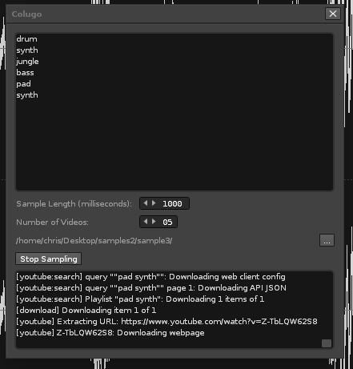
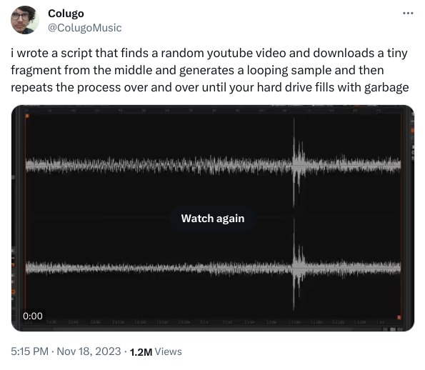

# Colugo



## Introduction

Colugo is a Renoise tool designed to enhance your music production workflow. It automates the process of creating samples from YouTube videos based on specified keywords, allowing you to specify the number of samples, their length, and more, to streamline your creative process in Renoise.

### History

I was inspired to create this Renoise tool based on this tweet from @ColugoMusic:

https://twitter.com/ColugoMusic/status/1726001266180956440



## Dependencies

Before using Colugo, ensure you have Python 3 installed on your system. Python is crucial for handling the core functionality of downloading and processing samples.

### Required Python Packages:

- `yt-dlp`: For downloading videos from YouTube.
- `pydub`: For processing audio samples.
- `ffmpeg`: Required by `pydub` for handling different audio formats.

Install these Python packages using pip:

```bash
pip install yt-dlp pydub
```

Note: ffmpeg might require a separate installation. Instructions can be found on the FFmpeg website.

## Installation
To install Colugo in Renoise, follow these steps:

1. Download the `.xrnx` file for Colugo.
2. Open Renoise.
3. Drag and drop the `.xrnx` file into the Renoise window to install it automatically.
4. Access the tool from the Renoise menu after installation.

## Usage
Here's how to use Colugo:

1. **Open the Tool:** Find Colugo in the Renoise menu and open it.
2. **Set Preferences:**
   - **Output Directory:** Click the '...' button to select a directory for saving samples.
   - **Number of Videos:** Set the number of YouTube videos to process.
   - **Sample Length:** Specify the sample length in milliseconds.
3. **Enter Keywords:** Type in keywords or phrases for the YouTube search in the text box.
4. **Start Sampling:** Click 'Start Sampling' to begin. Colugo will fetch and process videos based on your input.
5. **Stop/Cancel:** Click 'Stop Sampling' to halt the process.

## Notes
- A stable internet connection is required for downloading videos.
- Colugo adheres to YouTube's API usage limits and terms of service.

## Support
For queries or issues, raise an issue on the Colugo repository page.

